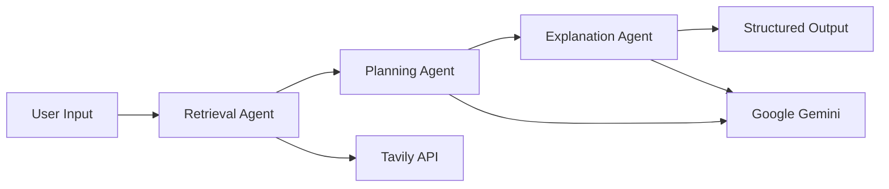

# 🚀 Kickstart AI Learning – Personalized Pathways Using Your Interests

**Kickstart** is an int### Backend
- **🤖 LangGraph 0.3.31** - Agentic AI orchestration
- **🧠 Google Gemini 2.5 Flash** - Language model for content generation
- **🔍 Tavily API** - Real-time web search and research
- **⚡ FastAPI 0.115.6** - Modern async web framework
-└── �️ Archive
    └── archive/                 # Moved unused/legacy files
        ├── backend_versions/    # Flask & old FastAPI
        ├── templates_legacy/    # HTML templates (moved)
        ├── unused_modules/      # Deprecated Python modules
        ├── scripts_and_config/ # Setup scripts & Docker  
        ├── frontend_assets/     # Old static files
        ├── cache/              # Python cache files
        └── README.md           # Archive documentationPydantic** - Structured data validation and API models
- **🔄 Uvicorn** - ASGI server for high performancent learning assistant powered by Agentic AI that transforms how you learn by creating personalized educational pathways tailored to **your hobbies**, **learning style**, and **domain interests**.

Whether you're passionate about **Cricket**, fascinated by **Harry Potter**, or love **Photography**, Kickstart uses your interests as bridges to make complex topics engaging, memorable, and relevant to your life.

---

## 🎯 Problem Statement & Solution

### The Problem
Traditional learning approaches often:
- 📚 Use generic, one-size-fits-all content
- 🥱 Lack personal relevance and engagement
- ⚡ Fail to connect new concepts to learner's existing interests
- 🔄 Don't adapt to individual learning styles
- 🌐 Struggle to incorporate latest trends and developments

### Our Solution
Kickstart leverages **Agentic AI architecture** with **LangGraph** to create truly personalized learning experiences:

1. **Hobby-Driven Learning**: Transforms abstract concepts using your personal interests as analogies
2. **Intelligent Research**: Uses Tavily API to gather latest information and trends
3. **Adaptive Pathways**: Google Gemini generates structured, progressive learning plans
4. **Multi-Modal Interfaces**: Both CLI and web interfaces for different use cases
5. **Real-time Personalization**: Dynamically adjusts content based on your profile

---

## 🌟 Live Demo

🔗 **Web Interface**: [Kickstart Learning Agent](https://kickstart-learning.onrender.com) _(Deployed on Render)_

---

## 🎯 Key Features

✅ **Personalized Learning Pathways** - Structured 7-phase learning plans  
✅ **Hobby-Based Examples** - Complex concepts explained through your interests  
✅ **Real-Time Research** - Latest trends and developments via Tavily API  
✅ **Historical Context** - Rich background with key milestones  
✅ **Project Ideas** - Practical applications in your domain  
✅ **Multiple Interfaces** - React web app, FastAPI backend, CLI for developers  
✅ **Agentic Architecture** - Intelligent task orchestration with LangGraph  

---

## 🖼️ Screenshots


*Clean, intuitive input form for learning preferences*


*Real example: Learning Android Development Kit through cricket analogies*


*Structured 7-phase learning pathway with clear progression*


*Detailed breakdown of each learning phase with actionable steps*


*Rich explanations with hobby-specific analogies and examples*


*Curated resources and links for deeper learning*

---

## 🏗️ Architecture Overview

### Agentic AI Pipeline


### Core Components
1. **`agent.py`** - Main entrypoint with `@entrypoint()` decorator
2. **`retrieval.py`** - Tavily-powered research and context gathering
3. **`structured_agent.py`** - Gemini-based pathway generation
4. **`explanation.py`** - Hobby-specific content creation
5. **`app_fastapi_new.py`** - FastAPI backend with async endpoints
6. **`main.py`** - CLI interface

---

## 🛠️ Tech Stack

### Backend
- **🤖 LangGraph 0.3.31** - Agentic AI orchestration
- **🧠 Google Gemini 2.5 Flash** - Language model for content generation
- **� Tavily API** - Real-time web search and research
- **🌐 Flask 3.1.0** - Web framework
- **� Pydantic** - Structured data validation

### Frontend
- **⚛️ React 19.1.1** - Modern UI framework
- **🎨 Tailwind CSS** - Utility-first styling
- **📝 React Markdown** - Rich content rendering
- **⚡ Vite** - Fast build tool

### Deployment
- **☁️ Render.com** - Cloud platform
- **🦄 Uvicorn** - ASGI server for FastAPI
- **🔧 Async Workers** - High-performance request handling

---

## 🚀 FastAPI Backend Features

### API Endpoints

Our FastAPI backend provides several endpoints for different use cases:

#### **Health Check**
```http
GET /health
```
Returns server status and basic system information.

#### **Generate Learning Pathway (Direct)**
```http
POST /api/generate-pathway-direct
Content-Type: application/json

{
  "learning_style": "Interactive examples",
  "progress": "Python basics", 
  "hobby": "Gaming",
  "domain": "Software Development",
  "google_api_key": "your_google_api_key",
  "tavily_api_key": "your_tavily_api_key"
}
```

#### **Generate Learning Pathway (React Frontend)**
```http
POST /api/generate-pathway
Content-Type: application/json

{
  "learningStyle": "Interactive examples",
  "topic": "Python basics",
  "hobbies": "Gaming", 
  "domain": "Software Development"
}
```
*Note: This endpoint uses environment variables for API keys*

### Interactive API Documentation

FastAPI automatically generates interactive API documentation:
- **Swagger UI**: `http://localhost:8000/docs`
- **ReDoc**: `http://localhost:8000/redoc`

### Performance Benefits

- **Async Support**: Native async/await for better concurrency
- **Type Safety**: Full Pydantic validation for requests/responses  
- **Auto Documentation**: OpenAPI/Swagger docs generated automatically
- **Better Error Handling**: Structured error responses
- **CORS Support**: Built-in CORS middleware for frontend integration

---

## 🚀 Quick Start

### Prerequisites
- **Python 3.8+** 
- **Node.js 16+** (for React frontend)
- **Google API Key** (for Gemini AI)
- **Tavily API Key** (for web search)

### Option 1: FastAPI Backend + React Frontend (Recommended)

1. **Clone the repository**
   ```bash
   git clone https://github.com/snikhil17/Agentic-AI-2025.git
   cd Agentic-AI-2025/kickstart-learning-using-agents
   ```

2. **Set up Python environment**
   ```bash
   # Create virtual environment
   python -m venv kickstart_env
   
   # Activate virtual environment
   # On Linux/Mac:
   source kickstart_env/bin/activate
   # On Windows:
   kickstart_env\Scripts\activate
   ```

3. **Install Python dependencies**
   ```bash
   pip install -r requirements.txt
   ```

4. **Configure environment variables (Optional)**
   ```bash
   # Create .env file (API keys can also be provided via UI)
   cp .env.example .env
   
   # Edit .env file with your API keys (optional)
   echo "GOOGLE_API_KEY=your_google_api_key_here" >> .env
   echo "TAVILY_API_KEY=your_tavily_api_key_here" >> .env
   ```

5. **Start the FastAPI backend server**
   ```bash
   python -m uvicorn app_fastapi_new:app --reload --host 0.0.0.0 --port 8000
   ```
   The FastAPI server will be available at `http://localhost:8000`

6. **Set up React frontend (in a new terminal)**
   ```bash
   cd adaptive-learning-agent
   npm install
   
   # Configure frontend environment
   echo "VITE_API_URL=http://localhost:8000" > .env.local
   
   # Start React development server
   npm run dev
   ```
   The React app will be available at `http://localhost:5173`

7. **Access the application**
   - Open your browser to `http://localhost:5173`
   - Fill in your learning preferences and API keys
   - Get your personalized learning pathway!

### Option 2: CLI Interface (For Developers)

1. **Follow steps 1-3 from Option 1**

2. **Run the CLI version**
   ```bash
   python main.py
   ```

3. **Interactive prompts will guide you through:**
   - Learning style preferences
   - Topic of interest
   - Your hobbies
   - Domain focus

### Option 3: Direct API Testing

You can also test the FastAPI backend directly using curl or any HTTP client:

```bash
# Start FastAPI server
python -m uvicorn app_fastapi_new:app --reload --host 0.0.0.0 --port 8000

# Test health endpoint
curl http://localhost:8000/health

# Test learning pathway generation
curl -X POST http://localhost:8000/api/generate-pathway-direct \
  -H "Content-Type: application/json" \
  -d '{
    "learning_style": "Interactive examples", 
    "progress": "Python basics",
    "hobby": "Gaming",
    "domain": "Software Development",
    "google_api_key": "your_google_api_key",
    "tavily_api_key": "your_tavily_api_key"
  }'
```

---

## 🔑 API Key Setup Guide

### Google API Key (Gemini AI)
1. Visit [Google AI Studio](https://aistudio.google.com/)
2. Sign in with your Google account
3. Click "Get API Key" → "Create API Key"
4. Copy your API key

### Tavily API Key (Web Search)
1. Visit [Tavily API](https://app.tavily.com/)
2. Sign up for a free account
3. Go to your dashboard
4. Copy your API key from the dashboard

### Environment Configuration
```bash
# .env file format
GOOGLE_API_KEY=AIzaSyC-your-actual-key-here
TAVILY_API_KEY=tvly-your-actual-key-here
```

---

## 📁 Project Structure

```
kickstart-learning-using-agents/
├── 🤖 Core Agent System
│   ├── agent.py                 # Main LangGraph entrypoint  
│   ├── retrieval.py             # Tavily search & research
│   ├── structured_agent.py      # Gemini pathway generation
│   ├── explanation.py           # Hobby-specific content creation
│   └── data_models.py           # Pydantic data structures
├── 🌐 Backend API
│   ├── app_fastapi_new.py       # FastAPI backend server (API-only)
│   └── main.py                  # CLI interface
├── ⚛️ React Frontend
│   └── adaptive-learning-agent/ # Complete React application
│       ├── App.tsx              # Main React component
│       ├── components/          # UI components
│       ├── services/            # API integration
│       └── types.ts             # TypeScript definitions
├── 📋 Configuration
│   ├── requirements.txt         # Python dependencies
│   ├── requirements-dev.txt     # Development dependencies
│   ├── render.yaml              # Deployment configuration
│   ├── .env.example            # Environment template
│   └── .gitignore              # Git ignore rules
├── 📚 Documentation
│   ├── README.md                # This file
│   ├── CONTRIBUTING.md          # Contribution guidelines
│   ├── ENHANCEMENTS.md          # Enhancement proposals
│   └── LICENSE                  # MIT license
├── 🧪 Testing
│   └── tests/                   # Test files
├── 📸 Assets
│   └── images/                  # Screenshots & demos
└── �️ Archive
    └── archive/                 # Moved unused/legacy files
        ├── backend_versions/    # Flask & old FastAPI
        ├── unused_modules/      # Deprecated Python modules
        ├── scripts_and_config/ # Setup scripts & Docker  
        ├── frontend_assets/     # Old static files
        ├── cache/              # Python cache files
        └── README.md           # Archive documentation
```

---

## 🔧 Advanced Configuration

### Customizing the AI Models

**Change Gemini Model Version**
```python
# In structured_agent.py
model = ChatGoogleGenerativeAI(
    model="gemini-2.5-flash",  # or "gemini-1.5-pro"
    api_key=student_profile.get("google_api_key")
)
```

**Adjust Search Parameters**
```python
# In retrieval.py
retriever = TavilySearchAPIRetriever(
    k=5,  # Number of search results
    search_depth="advanced",  # "basic" or "advanced"
    api_key=student_profile.get("tavily_api_key")
)
```

### Adding Custom Learning Styles

Edit the form options in the React frontend:
```typescript
// In adaptive-learning-agent/types.ts or components
const learningStyleOptions = [
  { value: "visual-learner", label: "Visual Learning with Diagrams" },
  { value: "hands-on", label: "Hands-on Project-Based Learning" },
  { value: "theoretical", label: "Deep Theoretical Understanding" }
];
```

---

## 🧪 Testing Your Setup

### Quick Health Check
```bash
# Test Python dependencies
python -c "import langgraph, fastapi; print('Dependencies OK')"

# Test API connectivity
python -c "
from langchain_google_genai import ChatGoogleGenerativeAI
from dotenv import load_dotenv
import os
load_dotenv()
model = ChatGoogleGenerativeAI(model='gemini-2.5-flash', api_key=os.getenv('GOOGLE_API_KEY'))
print('API Keys working!')
"
```

### Sample Test Run
```bash
# CLI test with sample data
python main.py
# When prompted, enter:
# Learning Style: "practical examples"
# Topic: "Machine Learning"
# Hobbies: "Photography, Cooking"
# Domain: "Healthcare"
```

---

## 🚀 Deployment Guide

### Deploy to Render.com (Recommended)

1. **Fork this repository**

2. **Connect to Render**
   - Go to [Render.com](https://render.com)
   - Create new Web Service
   - Connect your forked repository

3. **Update render.yaml for FastAPI**
   ```yaml
   services:
     - type: web
       name: kickstart-learning-fastapi
       env: python
       buildCommand: "pip install -r requirements.txt"
       startCommand: "uvicorn app_fastapi_new:app --host 0.0.0.0 --port $PORT"
       envVars:
         - key: PYTHON_VERSION
           value: "3.11"
   ```

4. **Configure Environment Variables**
   ```
   GOOGLE_API_KEY = your_google_api_key
   TAVILY_API_KEY = your_tavily_api_key
   ```

5. **Deploy**
   - Render will automatically use the updated configuration
   - Build time: ~5-10 minutes
   - Your FastAPI app will be live at `https://your-app-name.onrender.com`

6. **API Documentation**
   - FastAPI auto-generates interactive docs at `/docs`
   - Visit `https://your-app-name.onrender.com/docs` for API testing

### Deploy to Other Platforms

**Heroku**
```bash
# Add Procfile for FastAPI
echo "web: uvicorn app_fastapi_new:app --host 0.0.0.0 --port \$PORT" > Procfile
git add . && git commit -m "Deploy FastAPI to Heroku"
heroku create your-app-name
heroku config:set GOOGLE_API_KEY=your_key
heroku config:set TAVILY_API_KEY=your_key
git push heroku main
```

**Docker**
```dockerfile
FROM python:3.11-slim
WORKDIR /app
COPY requirements.txt .
RUN pip install -r requirements.txt
COPY . .
EXPOSE 8000
CMD ["uvicorn", "app_fastapi_new:app", "--host", "0.0.0.0", "--port", "8000"]
```

---

## 🤔 How It Works Internally

### 1. **Input Processing**
```python
student_profile = {
    "learning_style": "hands-on projects",
    "progress": "Agentic AI", 
    "hobby": "Photography, Rock Climbing",
    "domain": "Healthcare"
}
```

### 2. **Agentic Pipeline Execution**

**Step 1: Research Agent (`retrieval.py`)**
- Tavily API searches for latest information
- Gathers multiple perspectives on the topic
- Filters and ranks relevant content

**Step 2: Planning Agent (`structured_agent.py`)**  
- Google Gemini analyzes research + user profile
- Generates structured learning pathway
- Creates hobby-specific analogies

**Step 3: Output Generation**
- Combines research, pathway, and explanations
- Formats as structured JSON/HTML
- Returns comprehensive learning package

### 3. **Output Structure**
```json
{
  "title": "Photography-Inspired Guide to Agentic AI",
  "learning_phases": [...],
  "explanations": [...],
  "milestones": [...],
  "next_steps": [...],
  "relevant_links": [...]
}
```

---

## 🔍 Troubleshooting

### Common Issues

**❌ "API Key not found" Error**
```bash
# Check environment variables
python -c "import os; print(os.getenv('GOOGLE_API_KEY'))"
# Should return your key, not None
```

**❌ "Module not found" Error**
```bash
# Reinstall dependencies
pip install --upgrade -r requirements.txt
```

**❌ "Port already in use" Error**
```bash
# Kill process using port 8000 (FastAPI)
lsof -ti:8000 | xargs kill -9
# Or use different port
python -m uvicorn app_fastapi_new:app --port 8001
```

**❌ "python-multipart not found" Error (FastAPI)**
```bash
# Install missing FastAPI dependency
pip install python-multipart
```

**❌ "CORS Error" in React Frontend**
```bash
# Check if FastAPI server is running on correct port
curl http://localhost:8000/health
# Update React .env.local if needed
echo "VITE_API_URL=http://localhost:8000" > adaptive-learning-agent/.env.local
```

**❌ "422 Unprocessable Entity" (FastAPI)**
- Check your JSON payload matches the expected format
- Use `/docs` endpoint to see exact schema requirements
- Ensure all required fields are included

**❌ "Tavily API Limit Exceeded"**
- Free tier: 1000 requests/month
- Upgrade at [Tavily Pricing](https://app.tavily.com/pricing)

**❌ React Build Issues**
```bash
cd adaptive-learning-agent
rm -rf node_modules package-lock.json
npm install
npm run dev
```

### Debug Mode

Enable detailed logging in FastAPI:
```python
# In app_fastapi_new.py
import logging
logging.basicConfig(level=logging.DEBUG)

# Run with debug reload
python -m uvicorn app_fastapi_new:app --reload --log-level debug
```

Check logs:
```bash
# View detailed agent execution
tail -f logs/agent.log
```

---

## 📊 Performance Optimization

### Response Time Improvements
- **Caching**: Implement Redis for repeated queries
- **Async Processing**: Use Celery for background tasks
- **Model Selection**: Switch to Gemini-1.5-flash for faster responses

### Cost Optimization
- **Request Batching**: Combine similar queries
- **Smart Caching**: Cache Tavily searches for popular topics
- **Model Tiers**: Use appropriate Gemini model sizes

---

## 🤝 Contributing

### Development Workflow

1. **Fork & Clone**
   ```bash
   git clone https://github.com/YOUR_USERNAME/Agentic-AI-2025.git
   cd Agentic-AI-2025/kickstart-learning-using-agents
   ```

2. **Create Feature Branch**
   ```bash
   git checkout -b feature/your-feature-name
   ```

3. **Development Setup**
   ```bash
   pip install -r requirements-dev.txt  # Includes testing tools
   ```

4. **Run Tests**
   ```bash
   python -m pytest tests/
   ```

5. **Submit PR**
   - Ensure all tests pass
   - Add documentation for new features
   - Follow existing code style

### Areas for Contribution
- 🎨 **UI/UX**: Improve React components and styling
- 🔧 **Features**: Add new learning styles or domains
- 📚 **Content**: Expand hobby-based examples
- 🚀 **Performance**: Optimize API calls and caching
- 🧪 **Testing**: Add comprehensive test coverage

---

## 📈 Roadmap & Future Features

### ✅ Recently Completed (v1.5)
- [x] **FastAPI Migration Complete** - Fully migrated from Flask to FastAPI
- [x] **Modern Async Backend** - High-performance API with native async support
- [x] **Interactive API Docs** - Auto-generated Swagger/ReDoc documentation
- [x] **CORS Support** - Seamless React frontend integration
- [x] **Type-Safe APIs** - Full Pydantic validation for all endpoints
- [x] **Project Organization** - Moved legacy files to `older_version/` folder

### 🔄 Version 2.0 (Coming Soon)
- [ ] **Multi-language Support** - Learn in your preferred language
- [ ] **Learning Progress Tracking** - Save and resume pathways
- [ ] **Community Features** - Share and rate learning paths
- [ ] **Mobile App** - Native iOS/Android experience

### 🚀 Version 3.0 (Vision)
- [ ] **AI Tutor Chat** - Interactive Q&A during learning
- [ ] **Adaptive Assessments** - Smart quizzes and evaluations  
- [ ] **Learning Analytics** - Detailed progress insights
- [ ] **Enterprise Features** - Team learning and administration

---

## 📄 License

This project is licensed under the **MIT License** - see the [LICENSE](LICENSE) file for details.

---

## 🙏 Acknowledgments

- **LangGraph Team** - For the amazing agentic AI framework
- **Google AI** - For Gemini's powerful language capabilities  
- **Tavily** - For reliable web search API
- **Open Source Community** - For all the wonderful libraries used

---

## 🔗 Links & Resources

- 📖 **Documentation**: [Project Wiki](https://github.com/snikhil17/Agentic-AI-2025/wiki)
- 🐛 **Bug Reports**: [GitHub Issues](https://github.com/snikhil17/Agentic-AI-2025/issues)
- 💬 **Discussions**: [GitHub Discussions](https://github.com/snikhil17/Agentic-AI-2025/discussions)
- 📺 **Demo Videos**: [YouTube Playlist](https://youtube.com/playlist?list=your-playlist-id)

---